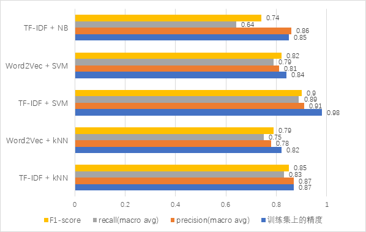

# “智慧政务”中的文本挖掘

> 原题：2020第八届泰迪杯数据挖掘挑战赛 C题
> https://www.tipdm.org/bdrace/tzbstysj/20200228/1637.html

## 任务（任务要求参见上方的题目链接）

### 任务一：群众留言分类

+ 本例代码参见notebook文件`src/issue1_more_clfs.ipynb`

采用了两种特征抽取方法TF-IDF和Word2Vec，三种分类模型Naive Bayes、kNN和SVM，形成五种实验方案，实验结果如下图所示

### 任务二：热点问题挖掘

+ 本例代码参见`src/issue2.py`

使用均值漂移模型完成文本聚类，另含热度评价模块，详见代码注释

## 项目依赖

+ 基于pyhton3.7.3平台
+ 需要openpyxl，gensim，sklearn，jieba，pandas，bayes_opt，numpy库以及它们的依赖包

## 最后

受时间和精力所限，代码组织并不十分合理，也没有为所有模块编写文档，如有想要深入了解的地方，欢迎在issue区开贴讨论